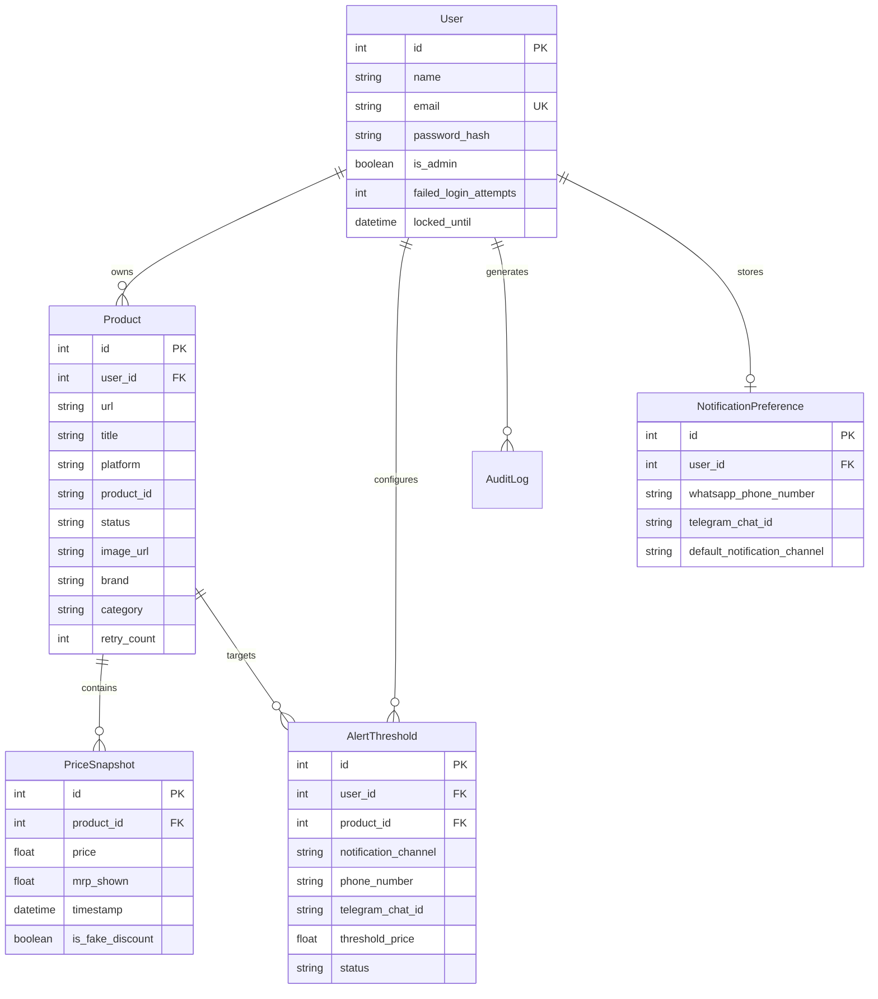

# Smart Price Tracker

Production-oriented price intelligence platform for tracking Amazon India and Flipkart products, analyzing historical prices, detecting potential fake discounts, and delivering automated price-drop alerts via WhatsApp and Telegram.

[](https://smart-price-tracker-xdgm.onrender.com/health)
[](https://smart-price-tracker-frontend.vercel.app)
[](https://www.python.org)
[](https://fastapi.tiangolo.com)
[](https://docs.celeryq.dev)
[](https://playwright.dev)
[](https://pytest.org)

---

## 🚀 Live Demo

- **Frontend Application (Vercel)**: [https://smart-price-tracker-frontend.vercel.app](https://smart-price-tracker-frontend.vercel.app)
- **Production API Server (Render)**: [https://smart-price-tracker-xdgm.onrender.com](https://smart-price-tracker-xdgm.onrender.com)
- **Interactive Swagger Documentation**: [https://smart-price-tracker-xdgm.onrender.com/docs](https://smart-price-tracker-xdgm.onrender.com/docs)
- **Production Health Endpoint**: [https://smart-price-tracker-xdgm.onrender.com/health](https://smart-price-tracker-xdgm.onrender.com/health)

---

## 📌 Overview

### The Problem
Major e-commerce platforms frequently alter product selling prices and Maximum Retail Prices (MRPs). During promotional sale events, merchants often artificially inflate the displayed MRP to create the illusion of a massive discount (e.g., listing a ₹1,000 product as "MRP ₹2,500, now 60% OFF at ₹1,000"). Consumers lack historical context to determine whether a discount is genuine or inflated.

### The Solution
**Smart Price Tracker** provides an automated, decoupled price intelligence and alert architecture that:
1. Periodically scrapes and canonicalizes product pricing data from **Amazon India** and **Flipkart**.
2. Preserves an **immutable historical timeline** of selling prices and displayed MRPs.
3. Applies a **deterministic mathematical fake-discount detection algorithm** based on 30-day moving averages.
4. Dispatches immediate **multi-channel price-drop alerts** via **WhatsApp** (Twilio Sandbox) and **Telegram Bot API**.

---

## ✨ Key Features

### 🛍️ Product & Price Intelligence
- **Marketplace Support**: Scrapes and tracks consumer gadgets on Amazon India (`amazon.in`, `amzn.in`) and Flipkart (`flipkart.com`, `dl.flipkart.com`).
- **URL Canonicalization & De-duplication**: Cleans tracking parameters (`qid`, `sr`, `tag`, `cmpid`) into canonical product identifiers (e.g., ASINs, Flipkart ITM/PIDs) preventing duplicate records per user.
- **Immutable Price Snapshots**: Appends new snapshots containing `price`, `mrp_shown`, `timestamp`, and `is_fake_discount` status without overwriting historical records.
- **Fake-Discount Detection**: Flags artificially inflated MRPs whenever a product's current MRP exceeds its 30-day historical average MRP by more than 10%.

### ⚡ Distributed Scraping & Task Engine
- **Asynchronous Scraping Pipeline**: Uses Celery worker queues backed by Redis broker to process background scraping jobs decoupled from HTTP request loops.
- **Hybrid Scraper Strategy (OOM Prevention)**:
  - **Fast HTTP Path**: Lightweight `requests` + `BeautifulSoup` scraper for Amazon India with ultra-low memory usage (< 30 MB RAM).
  - **Headless Playwright Fallback**: Full Chromium rendering engine with `--disable-dev-shm-usage` and `--no-sandbox` for JavaScript-heavy or JSON-LD schema parsing (Flipkart).
- **Stale Task Reconciliation**: Automatically reconciles interrupted tasks stuck in `SCRAPING` status during worker restarts.

### 🔔 Multi-Channel Alert & Preference System
- **Threshold Alerts**: Triggers notifications when a product's selling price reaches or drops below a user-defined target price.
- **Telegram & WhatsApp Integrations**: Supports instant alert delivery via Telegram Bot API (HTML formatted) and Twilio WhatsApp Sandbox (Markdown formatted).
- **Global Account Preferences**: Persistent account-level defaults (`NotificationPreference`) auto-fill destination numbers/chat IDs across all products.
- **Immediate Alert Confirmation**: Sends a direct confirmation message as soon as a price threshold alert is created.
- **Direct Notification Test Trigger**: Endpoint `POST /notifications/test` allows users to test notification delivery on demand.

### 🛡️ Enterprise Governance & Observability
- **Authentication**: JWT-based authentication with bcrypt password hashing, token expiration, and account lockout protection (5 failed attempts locks for 15 mins).
- **Comprehensive Health Monitoring**: `/health` endpoint inspects database connectivity, Redis connection, Celery worker ping, queue depth, CPU/Memory/Disk utilization, and notification provider readiness.
- **Prometheus Metrics**: Endpoints `/metrics/prometheus` track HTTP request durations, exception counts by type, and active worker metrics.
- **Audit Logging**: Structured JSON logging with trace IDs and database audit trail (`AuditLog`) recording authentication, product tracking, and administrative actions.

---

## 🏗️ Architecture

The application follows a strictly decoupled, layered architecture:

```
[ User Browser ]
       |
       v
[ Vercel Single-Page App (React / Vite) ]
       |
       | REST API (JWT Header)
       v
[ FastAPI Backend Application (Render Web Service) ]
       |
       +-------------------+-------------------+
       |                   |                   |
       v                   v                   v
[ SQLite / PostgreSQL ] [ Redis Queue ]   [ Prometheus Metrics ]
       |                   |
       |                   v
       |           [ Celery Worker ]
       |                   |
       |                   +-------------------+
       |                   |                   |
       |                   v                   v
       |           [ Amazon Scraper ]  [ Flipkart Scraper ]
       |           (HTTP / Playwright)    (Playwright)
       |                   |                   |
       +<------------------+-------------------+
       |
       v
[ Alert Engine ]
       |
       +-------------------+
       |                   |
       v                   v
[ Telegram Bot API ] [ Twilio WhatsApp ]
```

### Layer Separation
- **Frontend Layer**: React 18, Vite, Tailwind CSS, Recharts for price visualization.
- **API Layer**: FastAPI routes for authentication, dashboard metrics, product management, alerts, and preferences.
- **Service Layer**: Business logic for deal scoring, stale task recovery, task scheduling, and audit logging.
- **Repository / Database Layer**: SQLAlchemy ORM accessing PostgreSQL (Production) or SQLite (Development).
- **Scraper Module**: Completely isolated scrapers returning normalized dictionaries (`current_price`, `mrp_shown`, `title`, `image_url`, `brand`, `category`).

---

## 🔄 End-to-End Data Flow

### 1. Product Tracking Request
```
User submits URL -> FastAPI Canonicalizer -> Normalizes ASIN/PID -> Inserts Product (status='PENDING') -> Enqueues Celery Scrape Job -> Returns HTTP 202 Accepted
```

### 2. Background Scrape & Snapshot Execution
```
Celery Worker pops Job -> Marks Product (status='SCRAPING') -> Selects Scraper (Amazon/Flipkart) -> Extracts Data -> Computes Fake Discount -> Appends PriceSnapshot -> Marks Product (status='SUCCESS')
```

### 3. Price-Drop Alert Evaluation
```
Snapshot Created -> Evaluates Active AlertThresholds -> If Price <= Threshold -> Formats Message -> Calls NotificationProvider (Telegram/WhatsApp) -> Updates Alert (status='TRIGGERED')
```

---

## 🛠️ Technology Stack

| Layer | Technology | Details |
| :--- | :--- | :--- |
| **Backend Framework** | Python 3.13 / FastAPI | Asynchronous REST API, Pydantic validation, SlowAPI rate limiting |
| **Database & ORM** | PostgreSQL / SQLite / SQLAlchemy | Relational storage, indexed foreign keys, constraints, automated migration |
| **Task Queue & Broker** | Celery / Redis | Asynchronous background processing, worker pool management |
| **Web Scraping** | Requests / BeautifulSoup / Playwright | Fast HTTP HTML parsing + Headless Chromium JS execution |
| **Notification Services** | Telegram Bot API / Twilio | REST/HTTPS alerts, HTML & Markdown message formatters |
| **Frontend Framework** | React 18 / Vite | Tailwind CSS styling, Recharts visualization, Axios client |
| **Observability** | Prometheus Client / OpenTelemetry | Metrics collection, structured JSON tracing logger |
| **Deployment** | Render / Vercel / Docker | Web service + background worker containerization |

---

## 📊 Database Schema & Data Modeling

The data model enforces relational integrity with indexed foreign keys and immutable snapshot records:



---

## 🔍 Scraping Engine & Anti-Bot Engineering Case Study

### The 512 MB Container Memory Challenge
In cloud environments with strict RAM limits (e.g., Render Free tier at 512 MB RAM), launching Playwright Chromium inside a worker container frequently causes memory spikes exceeding the limit, triggering `SIGKILL` (Exit code 137) from the OS kernel and restarting the container.

### The Hybrid Scraper Solution
To solve this without increasing infrastructure costs:
1. **Lightweight HTTP Path (Amazon)**: The Amazon scraper executes an initial fast HTTP GET request using `requests` with realistic browser headers and parses HTML using `BeautifulSoup`. This extracts complete product metadata and prices using < 30 MB RAM in ~400ms.
2. **Headless Playwright Fallback**: If the lightweight fetch fails or encounters bot verification, the engine falls back to Playwright Chromium configured with resource-saving flags:
   ```python
   browser = await p.chromium.launch(
       headless=True,
       timeout=30000,
       args=["--disable-dev-shm-usage", "--no-sandbox", "--disable-setuid-sandbox", "--disable-gpu"]
   )
   ```
3. **JSON-LD Schema Extraction (Flipkart)**: Flipkart pages render initial price metadata inside embedded `<script type="application/ld+json">` tags. The Flipkart scraper extracts and parses structured JSON-LD objects directly, bypassing complex DOM selector mutations.

---

## 📈 Fake Discount & Price Intelligence Algorithm

A "fake discount" occurs when a merchant inflates the displayed MRP to present an artificially high discount percentage.

The detection algorithm is **deterministic and mathematical**:

$$\text{Average MRP}_{30\text{d}} = \frac{1}{N} \sum_{i=1}^{N} \text{MRP}_i \quad \text{for snapshots in last 30 days}$$

$$\text{Is Fake Discount} = \begin{cases} \text{True} & \text{if } \text{MRP}_{\text{latest}} > 1.10 \times \text{Average MRP}_{30\text{d}} \text{ and } N \ge 4 \\ \text{False} & \text{otherwise} \end{cases}$$

```python
def detect_fake_discount(db: Session, product_id: int) -> bool:
    thirty_days_ago = datetime.datetime.now(datetime.UTC) - datetime.timedelta(days=30)
    snapshots = db.query(PriceSnapshot).filter(
        PriceSnapshot.product_id == product_id,
        PriceSnapshot.timestamp >= thirty_days_ago
    ).order_by(PriceSnapshot.timestamp.desc()).all()

    if not snapshots or len(snapshots) < 5:
        return False

    latest_snapshot = snapshots[0]
    historical_snapshots = snapshots[1:]
    avg_mrp = sum(s.mrp_shown for s in historical_snapshots) / len(historical_snapshots)

    return latest_snapshot.mrp_shown > avg_mrp * 1.10
```

---

## ⚡ Real-World Production Fixes & Case Studies

### Case Study 1: Render Container OOM SIGKILL (Exit 137)
- **Symptom**: Products remained stuck in `SCRAPING` state forever; frontend polling timed out; worker container crashed continuously.
- **Root Cause**: Playwright Chromium launched by Celery worker consumed 450+ MB RAM, pushing total memory past 512 MB and causing kernel `SIGKILL`.
- **Resolution**: Implemented the Amazon HTTP + BeautifulSoup lightweight scraper path (< 30 MB RAM) and optimized Playwright launch flags. Single worker topology enforced via `start.sh`.

### Case Study 2: Stale Task Recovery on Application Startup
- **Symptom**: Products killed mid-scrape remained in `SCRAPING` status indefinitely.
- **Resolution**: Implemented startup reconciliation hook in `backend/main.py` that queries and updates interrupted products to `FAILED` status with explicit failure reasons upon server startup:
  ```python
  @app.on_event("startup")
  def reconcile_stale_products():
      with engine.begin() as conn:
          conn.execute(text(
              "UPDATE products SET status = 'FAILED', last_failure_reason = 'Scrape task interrupted by worker process termination' WHERE status = 'SCRAPING'"
          ))
  ```

### Case Study 3: Vercel SPA 404 Route Handling
- **Symptom**: Direct browser navigation to `/login` or `/register` on Vercel returned 404 Not Found.
- **Root Cause**: Vercel CDN treated client-side React routes as missing static files.
- **Resolution**: Created `vercel.json` with global rewrite rule sending all non-static asset routes to `/index.html`.

---

## ⚙️ Local Installation & Setup Guide

### Prerequisites
- Python 3.11+
- Node.js 18+
- Redis Server (local or Upstash Redis URL)

### 1. Clone Repository
```bash
git clone https://github.com/Koushik1708/smart-price-tracker.git
cd smart-price-tracker
```

### 2. Backend Setup
```bash
# Create and activate virtual environment
python -m venv venv
# On Windows:
venv\Scripts\activate
# On Linux/macOS:
source venv/bin/activate

# Install dependencies
pip install -r requirements.txt

# Install Playwright browser binaries
playwright install chromium
```

### 3. Environment Configuration
Create a `.env` file in the root directory:
```env
ENVIRONMENT=development
DATABASE_URL=sqlite:///./price_tracker.db
JWT_SECRET_KEY=your_secure_jwt_secret_key_at_least_32_chars
REDIS_URL=redis://localhost:6379/0

# Optional Notification Credentials
TWILIO_ACCOUNT_SID=your_twilio_sid
TWILIO_AUTH_TOKEN=your_twilio_token
TWILIO_WHATSAPP_NUMBER=whatsapp:+14155238886
TELEGRAM_BOT_TOKEN=your_telegram_bot_token
```

### 4. Run Backend & Worker
```bash
# Terminal 1: Run FastAPI Server
uvicorn backend.main:app --reload --port 8000

# Terminal 2: Run Celery Worker
python -m celery -A backend.celery_app:celery_app worker --loglevel=info -Q scraper_queue --pool=solo -c 1
```

### 5. Frontend Setup
```bash
cd frontend
npm install
npm run dev
```
Open [http://localhost:5173](http://localhost:5173) in your browser.

---

## 🧪 Testing & Quality Assurance

The project includes an extensive automated test suite covering unit logic, scrapers, notifications, preferences, and rate limits.

### Run Automated Tests
```bash
pytest tests/ -v
```

### Test Coverage Summary (51 / 51 Passed)
- **`test_url_canonicalization.py`**: Amazon ASIN extraction, Flipkart PID matching, query stripping, domain validation.
- **`test_fake_discount.py`**: 30-day moving average calculation, MRP spike detection, small dataset handling.
- **`test_lightweight_scraper.py`**: Fast HTTP parsing, HTML snapshot testing, stale task reconciliation.
- **`test_telegram.py`**: Telegram provider delivery, Twilio fallback, multi-channel alert dispatch, account-level preference CRUD, user isolation, direct notification trigger.
- **`test_dashboard_routes.py`**: Analytics summary metrics, recent product listings, price drop filtering.
- **`test_trigger_timeout.py`**: Rapid track endpoint response, non-blocking Celery dispatch.

---

## 🛡️ Security, Governance & Observability

- **Password Hashing**: Passwords stored using `bcrypt` via Passlib.
- **JWT Authorization**: Bearer token authentication required for product tracking, alert management, and administrative routes.
- **Rate Limiting**: SlowAPI limits login/registration to 5 requests/min and product tracking to 10 requests/min.
- **Input Sanitization**: Pydantic models sanitize and validate all incoming HTTP payloads.
- **OpenTelemetry Tracing**: Custom `tracing.py` injects `trace_id` and `span_id` into log context and API response headers.

---

## 📄 License & Author

Developed by **Koushik** as an enterprise-grade price intelligence and production engineering case study.

Licensed under the [MIT License](LICENSE).

