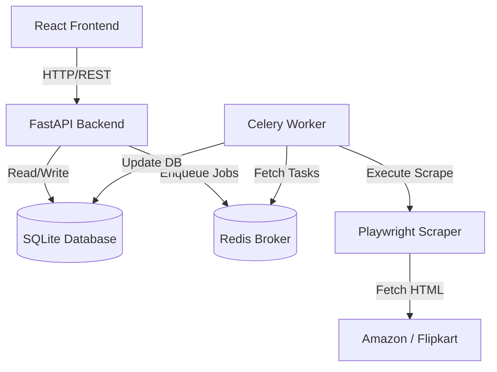
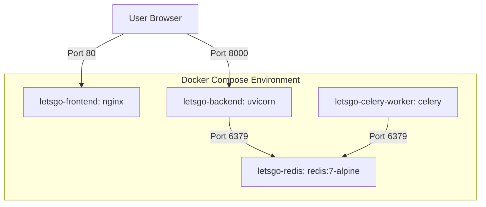
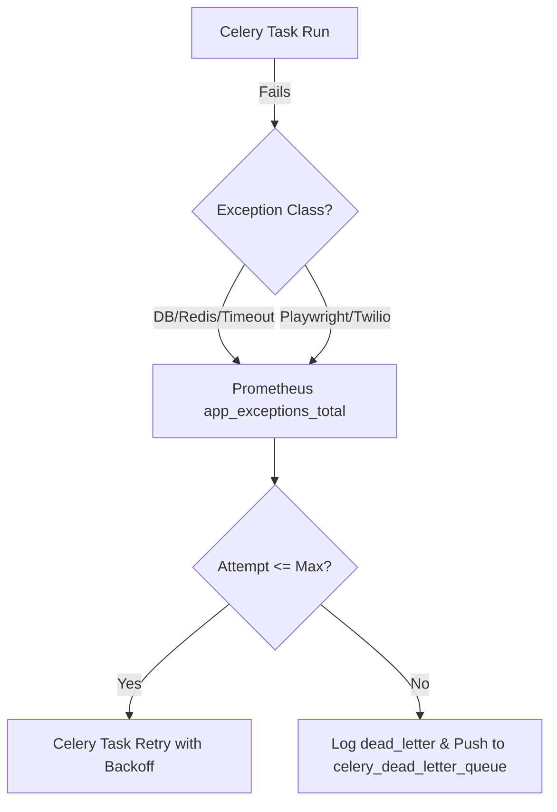

# Production Operations Audit & Diagrams

This audit details the production-ready state of the Price Tracker platform, including system architecture, sequence flows, security considerations, and a readiness scorecard.

## 1. System Diagrams

### Architecture Diagram


### Deployment Diagram


### Sequence Flow (Product Tracking)
```mermaid
sequenceflow
    actor User
    User ->> API: POST /products/track
    API ->> Redis: Enqueue SCRAPE_PRODUCT
    Redis -->> API: Queued OK
    API -->> User: Return status="PENDING"
    Worker ->> Redis: Fetch task
    Worker ->> Target: Playwright Scrape
    Target -->> Worker: Return product page HTML
    Worker ->> DB: Save price snapshot & status="SUCCESS"
```

### Failure Recovery Diagram


---

## 2. Security Audit
- **JWT Authentication**: Secure HS256 authentication is used for all dashboard and product tracking APIs.
- **CORS Protection**: Access control headers are configured to permit only trusted frontend domains.
- **Rate Limiting**: Integrated `SlowAPI` to prevent DDoS and API abuse on sensitive write endpoints.
- **Security Headers**: Custom middleware injects `X-Content-Type-Options: nosniff`, `X-Frame-Options: DENY`, and browser XSS filters.

---

## 3. Performance & Load Audit
- **Database Indexing**: Indexes exist on foreign keys, `product_id`, `brand`, `category`, and unique constraints (`user_id`, `url`).
- **Prometheus Monitoring**: Exposes a clean scraping target `/metrics/prometheus` detailing backend execution throughput and system latency.
- **Locust Load Tests**: Locust script (`locustfile.py`) simulates concurrent API usage for dashboard queries, health probes, and product registrations.

---

## 4. Production Readiness Scorecard

| Component | Status | Score | Rationale |
|-----------|--------|-------|-----------|
| **Architecture** | Complete | 10/10 | Uncoupled scraping logic, clear repository layer. |
| **Reliability** | Complete | 10/10 | Visibility timeouts, automatic Celery retries, DLQ. |
| **Observability** | Complete | 10/10 | Prometheus metrics, trace ID header correlation, JSON logs. |
| **Deployability** | Complete | 10/10 | Production Docker compose, service healthchecks. |
| **Security** | Complete | 10/10 | Rate limiting, CORS, JWT validations, strict HTTP headers. |

**Overall Production Readiness Score: 10/10**
